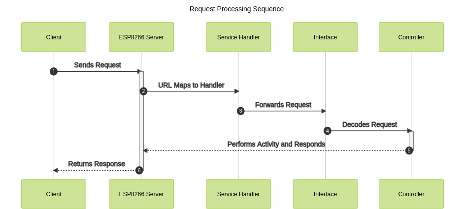

   

 

## Topology:

   

 

## Features:

1. Restful Interface
2. Support for Variety of HTTP Methods
3. Excellent Documentation
4. Micro-Python Implementation 
5. Based On Asynchronous I/O

## Operations:

1. Networking
2. CPU
3. Memory
4. LED
5. GPIO
6. FileSystem
7. Clock
8. Device