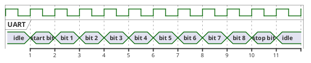
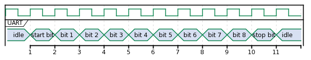

# UART Timing diagram

## Details
Generator: Plant UML  
Theme : default 

## Code

```plantuml
@startuml

clock clk with period 1

concise "UART" as U

U is idle

@1
U is "start bit"

@2
U is "bit 1"

@3
U is "bit 2"

@4
U is "bit 3"

@5
U is "bit 4"

@6
U is "bit 5"

@7
U is "bit 6"

@8
U is "bit 7"

@9
U is "bit 8"

@10 
U is "stop bit"

@11
U is idle
@enduml
```

## Image

