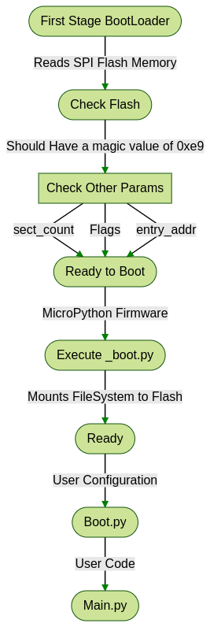

# Gantt Chart

## Details
Generator: Mermaid js   
Theme : forest 

## Code

```markdown
graph TD
    A([First Stage BootLoader]) -->|Reads SPI Flash Memory | B([Check Flash])
    B -->|Should Have a  magic value of 0xe9| C[Check Other Params]
    C -->|sect_count| D
    C -->|Flags| D([Ready to Boot])
    C -->|entry_addr| D
    D -->|MicroPython Firmware| E([Execute _boot.py])
    E -->|Mounts FileSystem to Flash| F([Ready])
    F -->|User Configuration|G([Boot.py])
    G -->|User Code|H([Main.py])
```

## Image


## Boot Process
The built in first stage bootloader reads the start of the SPI flash where it expects to find a simple 8 byte structure:
```c
typedef struct {
    uint8 magic;
    uint8 sect_count;
    uint8 flags1;
    uint8 flags2;
    uint32 entry_addr;
} rom_header;
```
The magic value should be 0xe9. sect\_count contains the number (may be zero) of elf sections to load to iram (this does not include the .irom.text section). flags1 \& flags2 control the flash size, clock rate and IO mode. entry\_addr contains the entry point to start executing user code from.

After the header come the actual elf sections. Each is headed by another 8 byte structure (followed immediately by the data itself):
```c
typedef struct {
    uint32 address;
    uint32 length;
} sect_header;
```
The first stage boot loader verifies the magic and sets the flash mode according to the flags. Then it copies each section to the corresponding address from the header (which should be within the iram section starting at 0x40100000). As the sections are loaded a single checksum is created of all the data (headers are not included). If the final checksum matches the one stored at the end of the elf section on the flash it will call the function found at entry\_addr.

The whole of the flash is also mapped to an area of memory from 0x40200000. The .irom.text elf section just sits somewhere on the flash after the other elf sections and does not have a header like those destined for iram. The default linker script eagle.v6.ld bases the section at 0x40240000 so it should be written to 0x40000. This mapping does not occur until later (presumably by sdk library code), so you can’t access the flash directly in memory in the boot loader – it must be accessed through spi read calls.

On boot, Micro-Python ESP8266 port executes \_boot.py script from internal frozen modules. It mounts file-system in Flash-ROM, or if it’s not available, performs first-time setup of the module and creates the file-system. This part of the boot process is considered fixed, and not available for customization for end users (even if you build from source, please refrain from changes to it; customization of early boot process is available only to advanced users and developers, who can diagnose themselves any issues arising from modifying the standard process).

Once the file-system is mounted, boot.py is executed from it. The standard version of this file is created during first-time module set up and has commands to start a WebREPL daemon (disabled by default, configurable with webrepl\_setup module), etc. This file is customizable by end users (for example, you may want to set some parameters or add other services which should be run on a module start-up). But keep in mind that incorrect modifications to boot.py may still lead to boot loops or lock ups, requiring to reflash a module from scratch. (In particular, it’s recommended that you use either webrepl\_setup module or manual editing to configure WebREPL, but not both).

As a final step of boot procedure, main.py is executed from file-system, if exists. This file is a hook to start up a user application each time on boot (instead of going to REPL). 