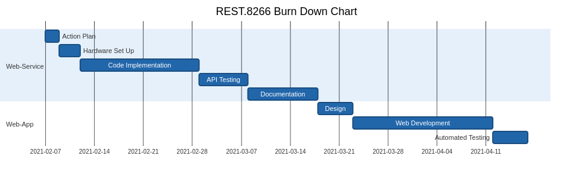

# Gantt Chart

## Details
Generator: Mermaid js 
Theme : neutral 

## Code

```markdown
gantt
    title REST.8266 Burn Down Chart
    dateFormat  YYYY-MM-DD
    todayMarker off
    section Web-Service
    Action Plan      :ap, 2021-02-07, 2d
    Hardware Set Up  :hsu, after ap  , 3d
    Code Implementation :ci,after hsu,17d
    API Testing :at,after ci, 7d
    Documentation :d,after at,10d
    section Web-App
    Design     :id,after d  , 5d
    Web Development :wd,after id,20d
    Automated Testing:att,after wd,5d
```

## Image

