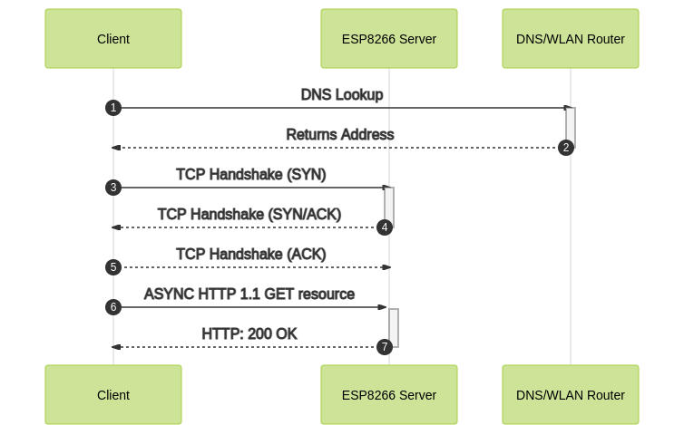

# Gantt Chart

## Details
Generator: Mermaid js  
Theme : forest 

## Code

```markdown
sequenceDiagram
    autonumber
    participant c as Client
    participant EX as ESP8266 Server
    participant DNS as DNS/WLAN Router
    c->>+DNS: DNS Lookup 
    DNS-->>-c: Returns Address
    c->>+EX: TCP Handshake (SYN)
    EX-->>-c: TCP Handshake (SYN/ACK)
    c -->>+EX: TCP Handshake (ACK)
    c ->>+EX: ASYNC HTTP 1.1 GET resource 
    EX -->>-c: HTTP: 200 OK
   
```

## Image

