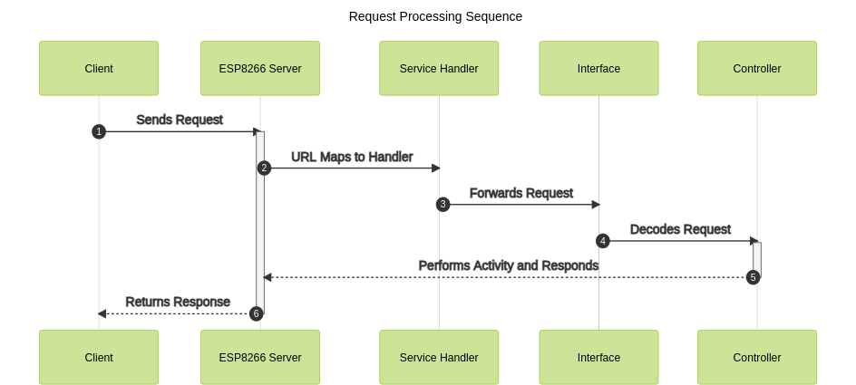

# Sequence Diagram

## Details
Generator: Mermaid js  
Theme : forest 

## Code

```markdown
sequenceDiagram
    autonumber
    participant c as Client
    participant EX as ESP8266 Server
    participant DNS as DNS/WLAN Router
    c->>+DNS: DNS Lookup 
    DNS-->>-c: Returns Address
    c->>+EX: TCP Handshake (SYN)
    EX-->>-c: TCP Handshake (SYN/ACK)
    c -->>+EX: TCP Handshake (ACK)
    c ->>+EX: ASYNC HTTP 1.1 GET resource 
    EX -->>-c: HTTP: 200 OK
   
```

## Image


## Code

```markdown
sequenceDiagram
    title : Request Processing Sequence 
    autonumber
    participant c as Client
    participant EX as ESP8266 Server
    participant SV as Service Handler
    participant IN as Interface
    participant CT as Controller
    c ->>+ EX: Sends Request
    EX ->>+ SV: URL Maps to Handler 
    SV ->>+ IN: Forwards Request
    IN ->>+ CT: Decodes Request
    CT -->>-EX: Performs Activity and Responds
    EX -->>-c: Returns Response
   
```

## Image

