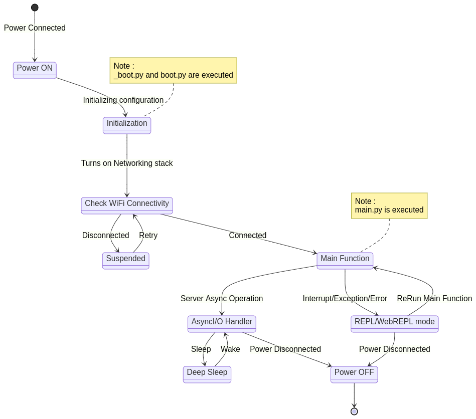

# State Diagram

## Details
Generator: Mermaid js   
Theme : default 

## Code

```markdown
stateDiagram-v2 
    s2 : Power ON
    s1 : Initialization
    s3 : Suspended 
    s4 : Deep Sleep
    s5 : Main Function
    s6 : AsyncI/O Handler
    s7 : Check WiFi Connectivity
    s8 : REPL/WebREPL mode
    s9 : Power OFF
    [*] --> s2 : Power Connected
    s2 --> s1 : Initializing configuration
    s1 --> s7 : Turns on Networking stack
    s7 --> s3 : Disconnected
    s3 --> s7 : Retry
    s7 --> s5 : Connected
    s5 --> s6 : Server Async Operation 
    s6 --> s4 : Sleep 
    s4 --> s6 : Wake
    s5 --> s8 : Interrupt/Exception/Error
    s8 --> s5 : ReRun Main Function
    s6 -->s9 : Power Disconnected
    s8 -->s9 : Power Disconnected
    s9 --> [*]
    note left of s1
            Note :
            _boot.py and boot.py are executed 
    end note
    note left of s5
            Note :
            main.py is executed 
    end note	
```

## Image


